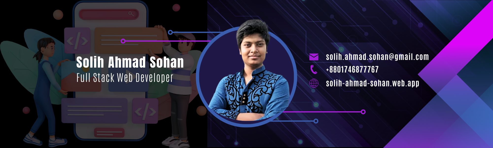

  

  <h1>Hi, I'm Solih Ahmad Sohan 👋</h1>
  <h3>AI Automation Engineer | Full-Stack AI Developer</h3>
  <h4>Specializing in n8n Agents, RAG Systems, and Business Process Automation</h4>

  

    
    
    
    
  

---

## 💡 What I Build (Business Solutions)
I don't just write scripts; I engineer **autonomous systems** that save time and generate revenue.

| 🤖 Autonomous Agents | 🏢 Enterprise Automation | 🧠 AI-Native SaaS |
| :--- | :--- | :--- |
| **Sales Agents:** AI that scrapes leads, enriches data, and sends personalized DMs. | **Operations:** Automated invoicing, CRM syncing, and customer support triage. | **Custom RAG:** Chatbots trained on your company's private PDF/Notion data. |
| **Content Engines:** Systems that turn 1 video into 10 social posts automatically. | **Error Handling:** Self-healing workflows that fix themselves when APIs fail. | **Full-Stack AI:** React/Next.js frontends integrated with Python backends. |

---

## 🚀 Featured Project: The Automation Suite
> *Stop paying for expensive monthly subscriptions. Own your automation infrastructure.*

### 🛠️ [n8n-authentic-workflows](https://github.com/sasohan0/n8n-authentic-workflows)
A production-grade repository of **Hybrid AI Agents** combining No-Code orchestration with Pro-Code engineering.

| Module | ROI / Business Value | Tech Stack |
| :--- | :--- | :--- |
| **🎥 YouTube Docu-Agent** | **Video Automation:** Generates full 10-minute documentary scripts, voiceovers, and visuals automatically. | `n8n` `Python` `MoviePy` `OpenAI` |
| **📢 Omni-Social Agent** | **Marketing Automation:** Converts a single URL into formatted posts for LinkedIn, X, and Instagram (with image generation). | `n8n` `Gemini Flash` `Pillow` `Buffer` |
| **🔍 Lead Gen & Enrich** | **Sales Automation:** Scrapes team pages, validates emails, and prepares outreach lists. | `n8n` `Hunter API` `Python DNS` |

[**Explore the Repository →**](https://github.com/sasohan0/n8n-authentic-workflows)

---

## 🧠 Engineering Stack

### **🤖 AI & Data Engineering**
| Category | Tools & Frameworks |
| :--- | :--- |
| **Orchestration** |    |
| **Generative AI** |   -000000?style=flat-square&logo=linux&logoColor=white) |
| **Vector & RAG** |   |

### **💻 Full-Stack AI Development**
> *Leveraging MERN expertise to build custom interfaces for AI Agents.*

| Category | Tools |
| :--- | :--- |
| **Backend & Scripting** |    |
| **Frontend** |    |
| **Infrastructure** |    |

---

## 📊 GitHub Analytics

  
  

---
"Need to know which tools to use? Check out my curated list: Awesome AI Automation Resources[https://github.com/sasohan0/awesome-ai-automation-resources] "

### 📬 Latest from the Newsletter
I write daily about **building authentic AI agents** and navigating the automation market.

   
  

